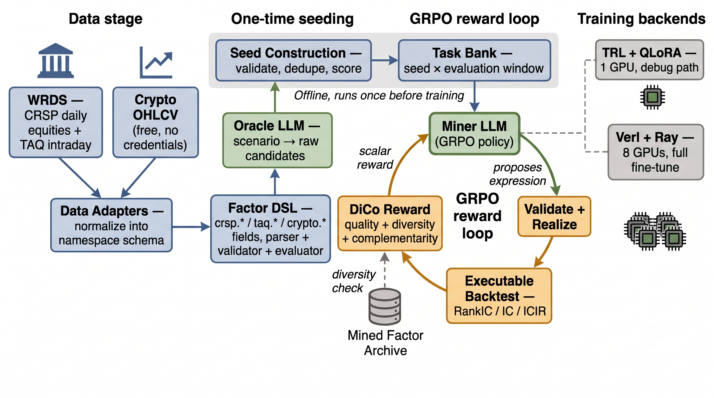

# Factor Lab: Reinforcement Learning for Alpha Factor Discovery

Reinforcement learning has recently gotten very good at teaching models to solve problems that share one property: a cheap, unambiguous way to check the answer, like a proof checker or a test suite. The model tries something, gets told plainly right or wrong, and improves from that signal alone. Financial markets don't offer that kind of feedback. There is no unit test for whether a trading idea is any good, only a backtest, and a backtest is noisy, easy to get lucky with, and shifts character as the market itself changes. Whether the propose-check-learn recipe that works so well for math and code still works when the checker is a real, gameable, drifting backtest instead of a fixed rulebook is an open question, and one this project is built to answer directly rather than assume.

A language model is trained to propose trading signals written in a small, restricted vocabulary rather than free-form code, specifically so every idea can be mechanically checked for validity — no looking into the future, no nonsense — before any computation is spent testing it. Each valid idea is then run against real market history: WRDS's CRSP and TAQ datasets, the same institutional-grade, survivorship-bias-free U.S. equity and intraday data actual quant desks rely on, plus a free, always-available crypto OHLCV (open, high, low, close, volume) dataset used to iterate quickly before committing to the slower, credentialed equity path. Whatever score an idea earns, reduced if it's just a rehash of something already found, becomes the model's entire training signal — no separate judge model, no human labeling, no hand-written reward beyond the backtest itself and a check for redundancy.

That framing turns this from an alpha-mining exercise into a stress test of a training recipe under conditions it wasn't originally built for: a reward that can be gamed, drifts, and never gives a clean yes or no. Two concrete, measurable things fall out of running it this way — whether the model actually learns to propose genuinely different ideas instead of repeating one lucky find, and which base models are even capable of following a restricted vocabulary well enough to learn from it at all. Using CRSP and TAQ rather than a generic or synthetic dataset is what makes the results here specific to real markets rather than a proxy for them.

Implementation details and exact run commands live in `runbook.md`.

Portions of the training approach are adapted from [QuantEvolver](https://github.com/QuantLLM/QuantEvolver).
